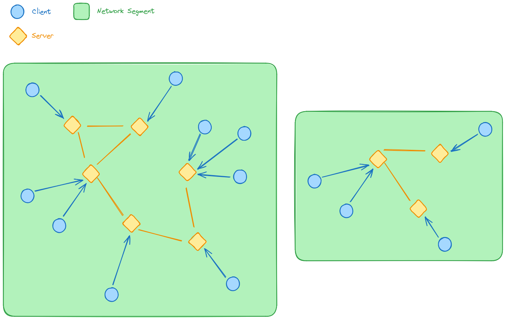

# Network architecture

The goal of the protocol is to provide a general way to resolve addresses (domain names or IP) of decentralized network clients by their public asymmetrical encryption keys. Protocol provides basic instruments to connect to the network, lookup clients, send and receive messages through it.

The key concept of the library is providing a decentralized DNS table and allowing different applications and computers to reuse the same endpoint (service) to search through the network and send/receive messages.

This is achieved by providing two types of clients: a `Client` and a `Server`. Clients are, essentially, HTTP clients + secret key holders. They are making special HTTP requests to the servers to communicate with and through the network. Servers are HTTP servers, holding information about local/remote clients, remote servers and state of the network. This allows us to reuse one local server service on computer by different applications, or to use globally available servers if client can't expose its local server to the network.



Here you can see two segments of the global network. Segment is a group of servers which can reach each other directly or through other servers. Potentially, these servers, depending on their configuration and implementation, will eventually find each other. Clients in this network can reach each other using `/api/v1/lookup` calls which will return local server's clients or give hint which will point to other servers which can be used to repeat this process.

Clients in different network segments can't lookup each other. To resolve this issue they need to be connected to the servers within the same segment.

# Servers REST API

## Status codes

| Group | Code | Description |
| - | - | - |
| Success | 100 | Request succeeded |
| Server error | 200 | Internal server failure |
| Protocol error | 300 | Invalid request |
| | 301 | Request certificate validation failed |
| | 310 | Client lookup timeout reached |
| | 311 | Couldn't find the client in the network |
| | 320 | Client is not connected to the server |
| | 321 | Client's inbox is full |
| | 322 | Message is too large |

## Base types

```ts
type Request<T> = {
    // Current standard version
    standard: 1,

    // Base64 encoded public key of the client who makes this request
    public_key: string,

    // Proof that the public key is real
    proof: {
        // Random 64 bits long positive integer (uint64)
        seed: number,

        // Base64 encoded digital signature of this integer
        sign: string
    },

    // Request's body
    request: T
};

type ResponseError = {
    // Current standard version
    standard: 1,

    // Response status code
    // Response *must* be `ResponseError` if the status code is not 1xx
    status: number,

    // Request failure reason
    reason: string
};

type ResponseSuccess<T> = {
    // Current standard version
    standard: 1,

    // Response status code
    // Response *must* be `ResponseSuccess` if the status code is 1xx
    status: number,

    // Base64 encoded public key of the server
    public_key: string,

    proof: {
        // Base64 encoded digital signature
        // of the original request proof's seed
        sign: string
    },

    // Response's body
    response: T
};

type Response<T> = ResponseError | ResponseSuccess<T>;
```

## `GET /api/v1/info`

Get basic information about the server. Needed for initial `connect` request to get the server's public key. Other fields can help clients to determine whether they should connect to this server.

```ts
type InfoResponse = {
    // Current standard version
    standard: 1,

    server: {
        // Base64 encoded public key of the server
        public_key: string
    },

    // Proof that the server's public key is real
    proof: {
        // Random 64 bits long positive integer (uint64)
        seed: number,

        // Base64 encoded digital signature of this integer
        sign: string
    },

    // Statistics implementation is optional, but recommended
    // because it allows clients to choose their servers wisely
    // and distribute load over the whole network
    stats?: {
        routing: {
            // Number of directly connected clients
            clients: number,

            // Number of known servers
            servers: number,

            // Size of the routing table (client -> server)
            table_size: number
        },

        service: {
            // Number of seconds the server is online
            uptime: number
        }
    }
};
```

## `GET /api/v1/clients`

Get list of clients connected to the server. This method is mostly needed for other servers to dynamically construct the routing table.

```ts
// `ConnectionCertificate` and `ClientInfo` are defined later
type Client = {
    // Base64 encoded public key of the client
    public_key: string,

    // Connection certificate
    certificate: ConnectionCertificate,

    // Information about the client
    client: ClientInfo
};

type ClientsResponse = {
    // Current standard version
    standard: 1,

    clients: Client[]
};
```

## `GET /api/v1/servers`

Get list of other servers known to the current one which implement this protocol. This method is mostly needed for other servers to dynamically construct the routing table.

```ts
type Server = {
    // Base64 encoded public key of the server
    public_key: string,

    // Address of the server
    address: string
};

type ServersResponse = {
    // Current standard version
    standard: 1,

    servers: Server[]
};
```

## `POST /api/v1/connect`

Establish connection with remote server.

### Connection token

Connection token structure:

1. `auth_date` - UTC timestamp when the client performed the connection requet. It must be a uint64 number with Big Endian encoding.
2. `public_key` - 33 bytes of the server's public key.

Certificate should proof that the client is connected to the current server. If eventually client will connect to another server - this server will have a new certificate with higher `auth_date` value, so he will be prioritized and the old server will be replaced by the new one in the routing table.

It is possible for client to name a wrong `auth_date`. This means, however, that the server with this faked certificate can keep the authority over the client for a long time so the client will not be able to use the network properly. It's in the client's interests to create correct `auth_date` timestamps.

Example connection token:

```
[0, 0, 0, 0, 102, 27, 141, 184, 2, 191, 43, 127, 14, 209, 119, 11, 168, 125, 39, 150, 247, 184, 33, 101, 224, 62, 201, 165, 78, 232, 105, 89, 52, 65, 215, 117, 117, 233, 111, 225, 182]
```

### Client type

- `thin` - this client is connected to the server and polls messages from its inbox. It doesn't have any other way of communication.
- `thick` - this client uses its server to announce the network about its existance and to lookup other clients in this network. It accepts direct requests to the announced address.
- `server` - this client can work as the network server. It's needed to allow people with static IP addresses to serve the content over the network without traditional DNS.
- `file` - this is a virtual client needed to host dynamic URIs to the files.

> The difference between `thick` and `server` client types is that the `thick` client implements arbitrary protocol while `server` promises that the protocol it implements is compatible with the current standard.

```ts
type ThinClient = {
    type: 'thin'
};

type ThickClient = {
    type: 'thick',

    // Announced address of the client. Examples:
    // - http://example.org
    // - tcp://1.2.3.4:9000
    // - ws://ws.example.org
    address: string
};

type ServerClient = {
    type: 'server',

    // Announced address of the server
    address: string
};

type FileClient = {
    type: 'file',

    // Announced address of the file
    address: string
};

type ClientInfo =
    | ThinClient
    | ThickClient
    | ServerClient
    | FileClient;
```

### Types

```ts
type ConnectionCertificate = {
    // Base64 encoded connection token
    token: string,

    // Base64 encoded sign of the token
    sign: string
};

type ConnectRequest = Request<{
    // Connection certificate
    certificate: ConnectionCertificate,

    // Information about the client
    client: ClientInfo
}>;

type ConnectResponse = Response<void>;
```

## `POST /api/v1/lookup`

Lookup client with given public key in the network.

### Response types

- `local` - given client is connected to the current server.
- `remote` - given client is connected to another server.
- `hint` - there's no records about this client saved in the current server. Instead we're giving a hint - list of another servers which we could ask to find the needed client.

### Types

```ts
type LookupRequest = Request<{
    // Base64 encoded public key of the client
    // we want to find in the network
    public_key: string,

    // Type of the client we want to find, null if any
    type: string | null
}>;

// Lookup client is connected to the current server
type LookupResponseLocal = {
    disposition: 'local',

    result: {
        // Local client info
        client: Client,

        // Is the client available
        // Determined by the current server
        available: boolean
    }
};

// Lookup client is connected to remote server
type LookupResponseRemote = {
    disposition: 'remote',

    result: {
        // Remote client info
        client: Client,

        // Client's server info
        server: Server,

        // Is the client available
        // Determined by the current server
        available: boolean
    }
};

// Lookup client is not connected to local client, and current server
// doesn't know to which remote server it is connected.
// Current server can return a list of servers that can possibly know
// where given client is.
type LookupResponseHint = {
    disposition: 'hint',
    result: {
        servers: Server[]
    }
};

type LookupResponse = Response<LookupResponseLocal | LookupResponseRemote | LookupResponseRemoteHint>;
```

## `POST /api/v1/announce`

Announce a client-server pair or just a server to another server.

It is expected that a client or a server will run this request over its known remote servers if the server can be accessed globally through the Internet.

If this method is not called, then (depending on implementation) other servers will not be aware of you, and would not be able to perform lookup requests on your server's local clients.

### Types

```ts
type AnnounceRequestClient = {
    announce: 'client',

    // Information about the client
    client: Client,

    // Server to which the client is connected
    server: Server,

    // Certificate that proves that the client
    // is connected to the given server
    certificate: ConnectionCertificate
};

type AnnounceRequestServer = {
    announce: 'server',

    // Information about the server
    server: Server
};

type AnnounceRequest = Request<AnnounceRequestClient | AnnounceRequestServer>;

type AnnounceResponse = Response<void>;
```

## `POST /api/v1/send`

Send message to the connected client through its server.

### Encodings

List of messages encoding formats that must be supported by all the protocols implementers.

#### Plain text

Format: `<encoding>`.

| Encoding | Description |
| - | - |
| `base64` | Base64-encoded plain text value |

#### With compression

Format: `<encoding>/<compression>`.

| Encoding | Description |
| - | - |
| `base64/deflate` | Base64-encoded value with [deflate](https://en.wikipedia.org/wiki/Deflate) compression |
| `base64/brotli` | Base64-encoded value with [brotli](https://en.wikipedia.org/wiki/Brotli) compression |

> Note: according to [this paper](https://cran.r-project.org/web//packages/brotli/vignettes/brotli-2015-09-22.pdf) brotli compression has
> really good results in comaprison with other popular compression methods, including deflate, when used on small files.

#### With encryption

Format: `<encoding>/<encryption>`.

| Encoding | Description |
| - | - |
| `base64/aes256-gcm` | Base64-encoded value encrypted with [AES-256-GCM](https://en.wikipedia.org/wiki/Advanced_Encryption_Standard) |
| `base64/chacha20-poly1305` | Base64-encoded value encrypted with [ChaCha20-Poly1305](https://en.wikipedia.org/wiki/ChaCha20-Poly1305) |

> Note: ChaCha20-Poly1305 is a modern algorithm originated from the stream encryption algorithm ChaCha20. This makes it much faster than AES-256, even with hardware acceleration modules.

#### With compression and encryption

Format: `<encoding>/<encryption>/<compression>`.

| Encoding | Description |
| - | - |
| `base64/aes256-gcm/deflate` | Base64-encoded value compressed with [deflate](https://en.wikipedia.org/wiki/Deflate) and encrypted with [AES-256-GCM](https://en.wikipedia.org/wiki/Advanced_Encryption_Standard) |
| `base64/chacha20-poly1305/deflate` | Base64-encoded value compressed with [deflate](https://en.wikipedia.org/wiki/Deflate) and encrypted with [ChaCha20-Poly1305](https://en.wikipedia.org/wiki/ChaCha20-Poly1305) |
| `base64/aes256-gcm/brotli` | Base64-encoded value compressed with [brotli](https://en.wikipedia.org/wiki/Brotli) and encrypted with [AES-256-GCM](https://en.wikipedia.org/wiki/Advanced_Encryption_Standard) |
| `base64/chacha20-poly1305/brotli` | Base64-encoded value compressed with [brotli](https://en.wikipedia.org/wiki/Brotli) and encrypted with [ChaCha20-Poly1305](https://en.wikipedia.org/wiki/ChaCha20-Poly1305) |

Operations order:

1. Compression (if presented)
2. Encryption (if presented)
3. Encoding

> Encryption and digital signatures generators must use pre-defined nonces. Refer to the standard implementation for details.

### Types

```ts
type Sender = {
    client: Client,
    server: Server
};

type Message = {
    // Encoded message
    content: string,

    // Encoded sign of the message
    sign: string,

    // Encoding of the message and its sign
    encoding: string
};

type SendRequest = Request<{
    // Client and server information about the
    // message's author so we can send a response there
    sender: Sender,

    // Information about the message's receiver
    receiver: {
        // Base64 encoded public key of the client
        // this message should be sent to
        public_key: string
    },

    // Name of the channel this message should be sent to
    // This is an arbitrary value needed for software development
    channel: string,

    // The message itself
    message: Message
}>;

type SendResponse = Response<void>;
```

> Note that it's expected that the sender client is connected to the server
> reachable by the global network, and that the `sender.server` field is correct.
> It's still possible to give any arbitrary data there, and its filtering
> purely depends on the standard implementation in software.
> For example, a library can try to request `/api/v1/info` to check that the server is real.
> 
> Another option is to give there a loopback address of the server. E.g., if
> some client send a message to another client's server, it can specify this
> server as the `sender.server` so the response will be sent to the same server.
> This case should also be covered by the implementation purely - some servers
> may allow this behavior, some (publicly available) would like to avoid this.

## `POST /api/v1/poll`

Read data frames sent to the current client from the server.

### Types

```ts
type PollRequest = Request<{
    // Channel from which we want
    // to read the inbox messages
    channel: string,

    // Maximal number of messages to read
    // If null, then decided by the server
    limit: number | null
}>;

type MessageInfo = {
    // Information about the client
    // that sent this message
    sender: Sender,

    // Channel to which this message was sent
    channel: string,

    // The message itself
    message: Message,

    // UTC timestamp at which this message was received
    received_at: number
};

type PollResponse = Response<{
    messages: MessageInfo[],

    // Amount of remaining messages to read
    remaining: number
}>;
```
